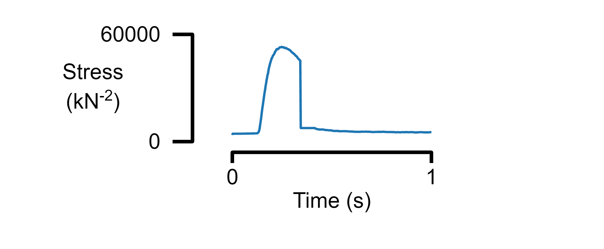
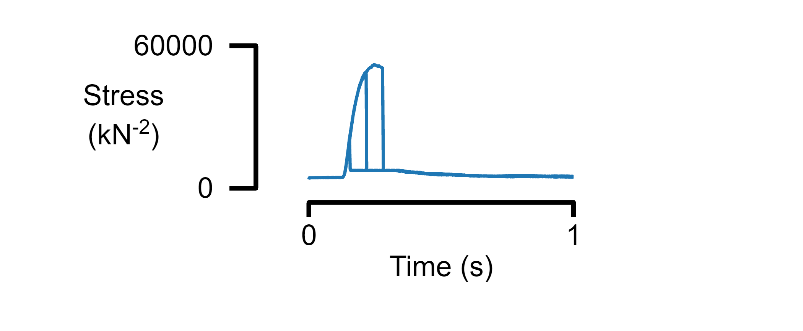
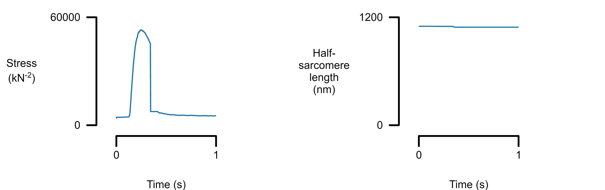

```matlab
% View an example table
single_data_file = "data/sim_prot_1_7_r1.txt";
d = readtable(data_file_string)
```


| |time|m_length|m_force|sc_extension|sc_force|hs_1_pCa|hs_1_length|hs_1_command_length|hs_1_slack_length|hs_1_a_length|hs_1_m_length|hs_1_force|hs_1_titin_force|hs_1_viscous_force|hs_1_extracellular_force|hs_1_inter_hs_titin_force_effect|hs_1_a_pop_1|hs_1_a_pop_2|hs_1_m_pop_1|hs_1_m_pop_2|hs_1_m_pop_3|hs_1_m_pop_4|hs_1_c_pop_1|hs_1_c_pop_2|hs_1_c_pop_3|
|:--:|:--:|:--:|:--:|:--:|:--:|:--:|:--:|:--:|:--:|:--:|:--:|:--:|:--:|:--:|:--:|:--:|:--:|:--:|:--:|:--:|:--:|:--:|:--:|:--:|:--:|
|1|0.001|1100|3685.3|0.073707|3685.3|9.23|1099.9|1100|NaN|1015.9|809.12|3685.3|4420.5|-737.07|0|0|1|0|0.93499|0.065008|0|0|1|0|0|
|2|0.002|1100|4298|0.08596|4298|8.93|1099.9|1100|NaN|1015.9|809.12|4298|4420.2|-122.53|0|0|1|0|0.88513|0.11487|0|0|1|0|0|
|3|0.003|1100|4399.9|0.087997|4399.9|8.76|1099.9|1100|NaN|1015.9|809.12|4399.9|4420.2|-20.37|0|0|0.99986|0.00014468|0.8506|0.1494|0|0|1|0|0|
|4|0.004|1100|4416.8|0.088336|4416.8|8.64|1099.9|1100|NaN|1015.9|809.12|4416.8|4420.2|-3.3865|0|0|0.99971|0.00028935|0.82398|0.17602|0|0|1|0|0|
|5|0.005|1100|4419.6|0.088392|4419.6|8.54|1099.9|1100|NaN|1015.9|809.12|4419.6|4420.2|-0.56299|0|0|1|0|0.80064|0.19936|0|0|1|0|0|
|6|0.006|1100|4420.1|0.088401|4420.1|8.47|1099.9|1100|NaN|1015.9|809.12|4420.1|4420.2|-0.093594|0|0|0.99986|0.00014468|0.78868|0.21132|0|0|1|0|0|
|7|0.007|1100|4420.1|0.088403|4420.1|8.41|1099.9|1100|NaN|1015.9|809.12|4420.1|4420.2|-0.01556|0|0|0.99957|0.00043403|0.77758|0.22242|0|0|1|0|0|
|8|0.008|1100|4420.2|0.088403|4420.2|8.35|1099.9|1100|NaN|1015.9|809.12|4420.2|4420.2|-0.0025868|0|0|0.99957|0.00043403|0.76553|0.23447|0|0|1|0|0|
|9|0.009|1100|4420.2|0.088403|4420.2|8.31|1099.9|1100|NaN|1015.9|809.12|4420.2|4420.2|-0.00043258|0|0|0.99957|0.00043403|0.75309|0.24691|0|0|1|0|0|
|10|0.01|1100|4420.2|0.088403|4420.2|8.26|1099.9|1100|NaN|1015.9|809.12|4420.2|4420.2|-6.9858e-05|0|0|0.99899|0.0010127|0.74817|0.25183|0|0|1|0|0|
|11|0.011|1100|4420.2|0.088403|4420.2|8.23|1099.9|1100|NaN|1015.9|809.12|4420.2|4420.2|-1.1305e-05|0|0|0.99913|0.00086806|0.74093|0.25907|0|0|1|0|0|
|12|0.012|1100|4420.2|0.088403|4420.2|8.19|1099.9|1100|NaN|1015.9|809.12|4420.2|4420.2|-1.9008e-06|0|0|0.99913|0.00086806|0.73708|0.26292|0|0|1|0|0|
|13|0.013|1100|4420.2|0.088403|4420.2|8.16|1099.9|1100|NaN|1015.9|809.12|4420.2|4420.2|-3.8426e-07|0|0|0.99913|0.00086806|0.73293|0.26707|0|0|1|0|0|
|14|0.014|1100|4420.2|0.088403|4420.2|8.14|1099.9|1100|NaN|1015.9|809.12|4420.2|4420.2|-1.0232e-07|0|0|0.99884|0.0011574|0.73052|0.26948|0|0|1|0|0|


```matlab
% View a simple template
template_file_1 = "templates/template_1.json";
t = readstruct(template_file_1)
```

```matlabTextOutput
t = struct with fields:
        layout: [1x1 struct]
     x_display: [1x1 struct]
    formatting: [1x1 struct]
        panels: [1x1 struct]
```


Simplest figure

```matlab
% Create a figure
figure_multi_x(single_data_file, template_file_1)
```




Plot data from multiple files

```matlab
% Plot three tables with the same format
multiple_data_files = [ ...
    "data/sim_prot_1_1_r1.txt", ...
    "data/sim_prot_1_3_r1.txt", ...
    "data/sim_prot_1_5_r1.txt"];

figure_multi_x(multiple_data_files, template_file_1)
```




Plot multiple panels


Add the panels to the template

```matlab
template_file_2 = "templates/template_2.json";

figure_multi_x(single_data_file, template_file_2)
```




Plot multiple panels


Add another panel to column 2

```matlab
template_file_3 = "templates/template_3.json"
```

```matlabTextOutput
template_file_3 = "templates/template_3.json"
```

```matlab

figure_multi_x(single_data_file, template_file_3)
```


Plot multiple traces from the same data file

```matlab
template_file_4 = "templates/template_4.json"
```

```matlabTextOutput
template_file_4 = "templates/template_4.json"
```

```matlab

figure_multi_x(single_data_file, template_file_4)
```


