Header


\-\-\-


Single panel with default padding

```matlab
layout_subplots();
```

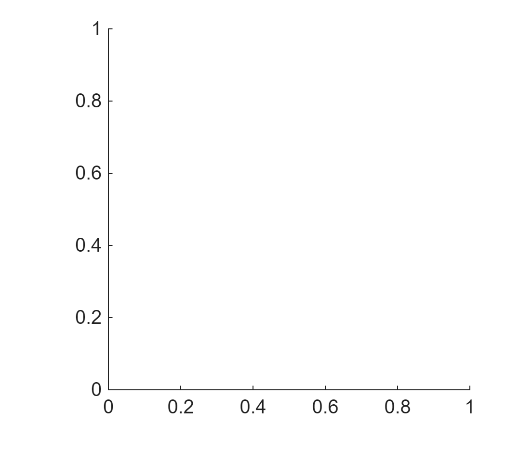

Change figure width

```matlab
layout_subplots( ...
    figure_width = 6);
```

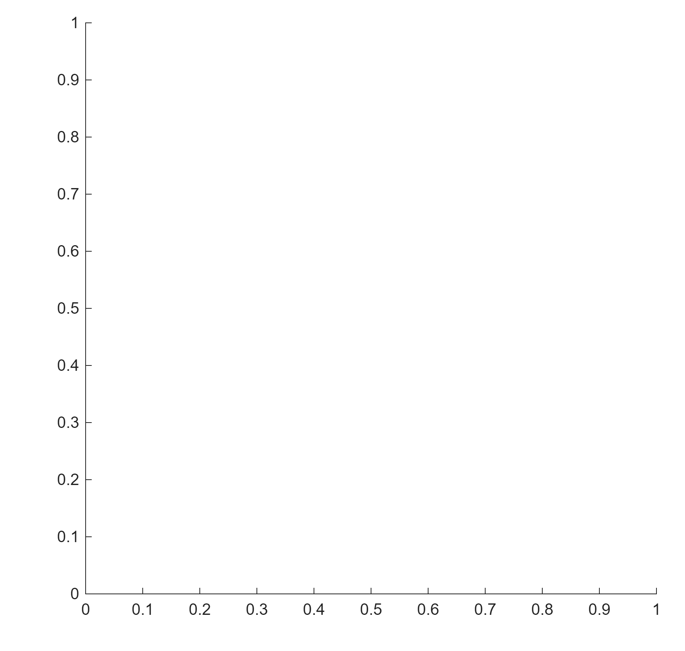

Two panels across

```matlab
layout_subplots( ...
    panels_wide = 2);
```

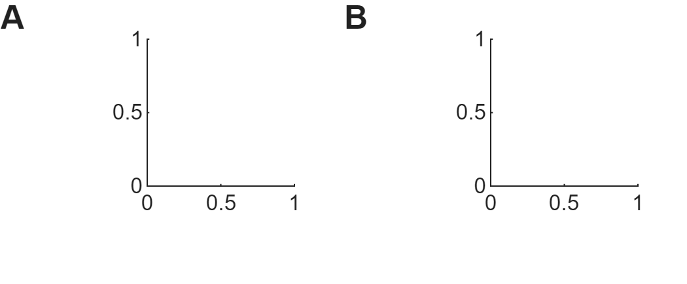

Change horizontal padding

```matlab
layout_subplots( ...
    panels_wide = 2, ...
    padding_left = 0.3, ...
    padding_right = 0.6);
```

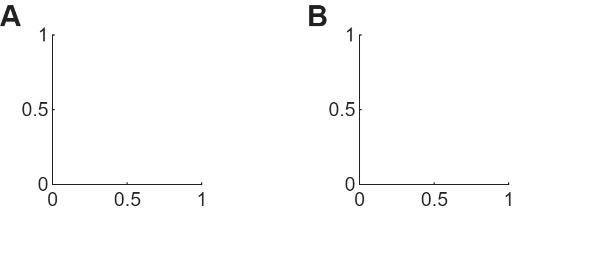

Multiple rows

```matlab
layout_subplots( ...
    panels_wide = 2, ...
    panels_high = 2);
```

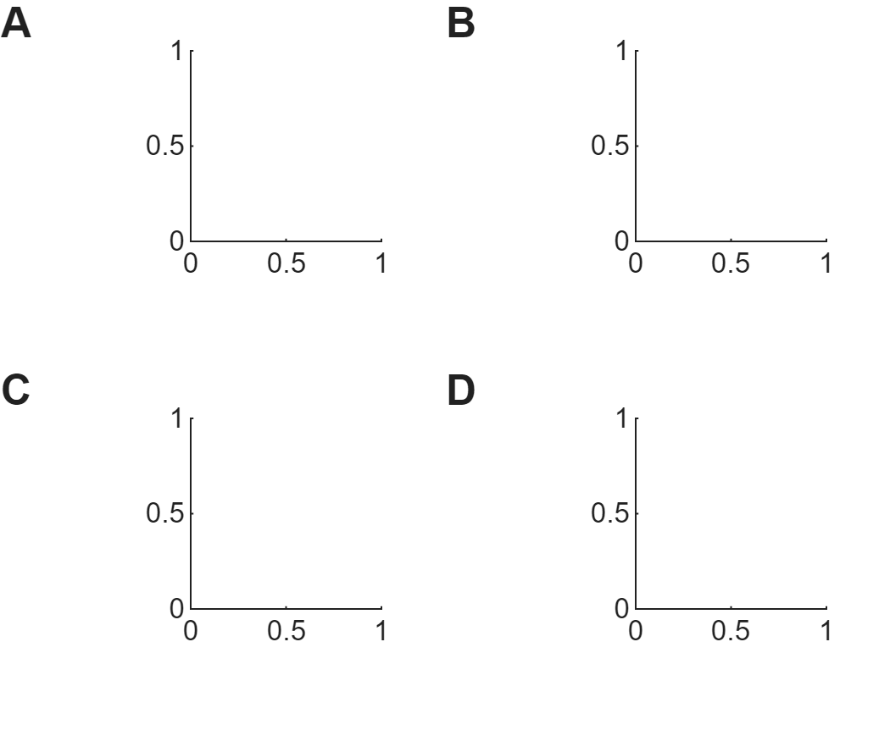

Change vertical padding

```matlab
layout_subplots( ...
    panels_wide = 2, ...
    panels_high = 2, ...
    padding_top = 0.5, ...
    padding_bottom = 0.1);
```

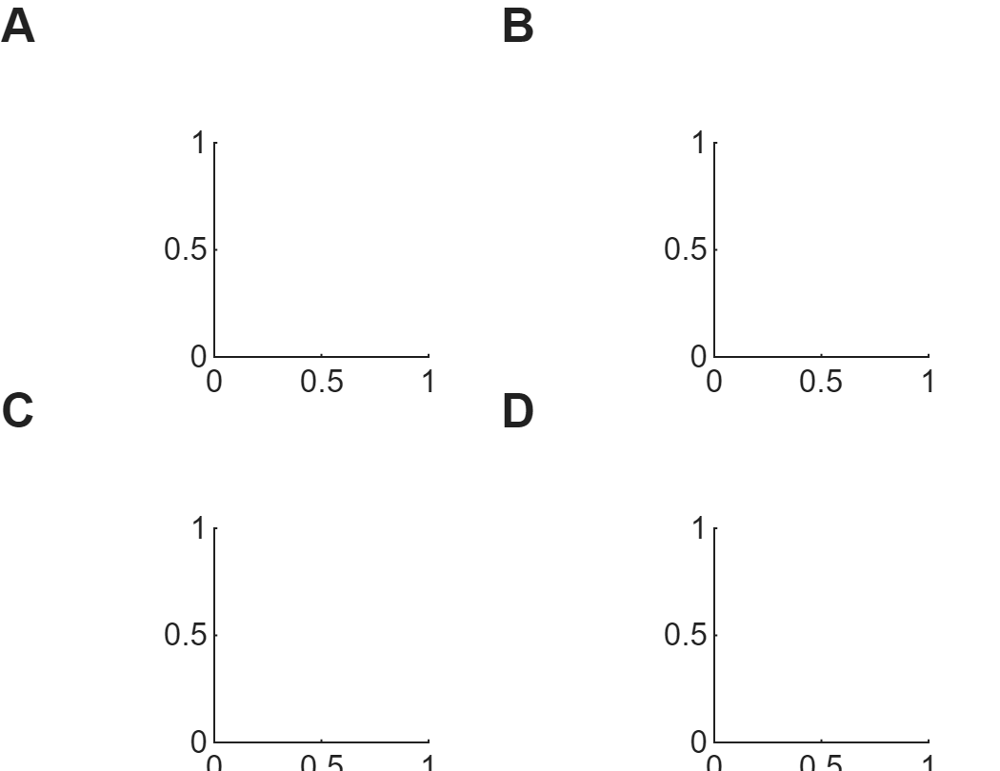

Different padding for different columns

```matlab
layout_subplots( ...
    panels_wide = 2, ...
    panels_high = 2, ...
    padding_left = [1 0.2]);
```

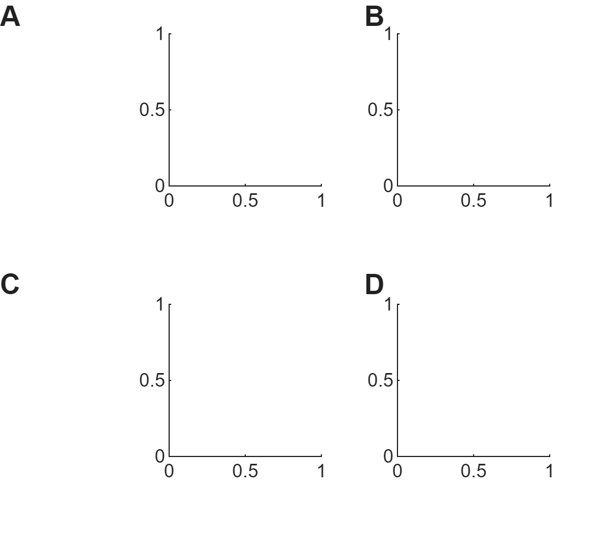

Different padding for different rows

```matlab
layout_subplots( ...
    panels_wide = 2, ...
    panels_high = 2, ...
    padding_top = [1 0.2]);
```

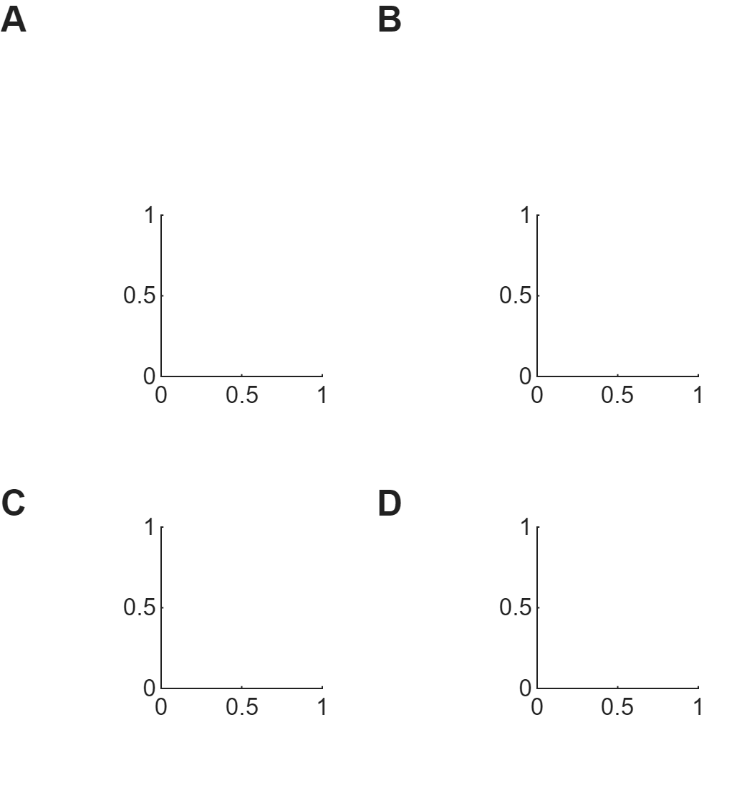

Omit panels

```matlab
layout_subplots( ...
    panels_wide = 2, ...
    panels_high = 2, ...
    omit_subplots = [2 3]);
```

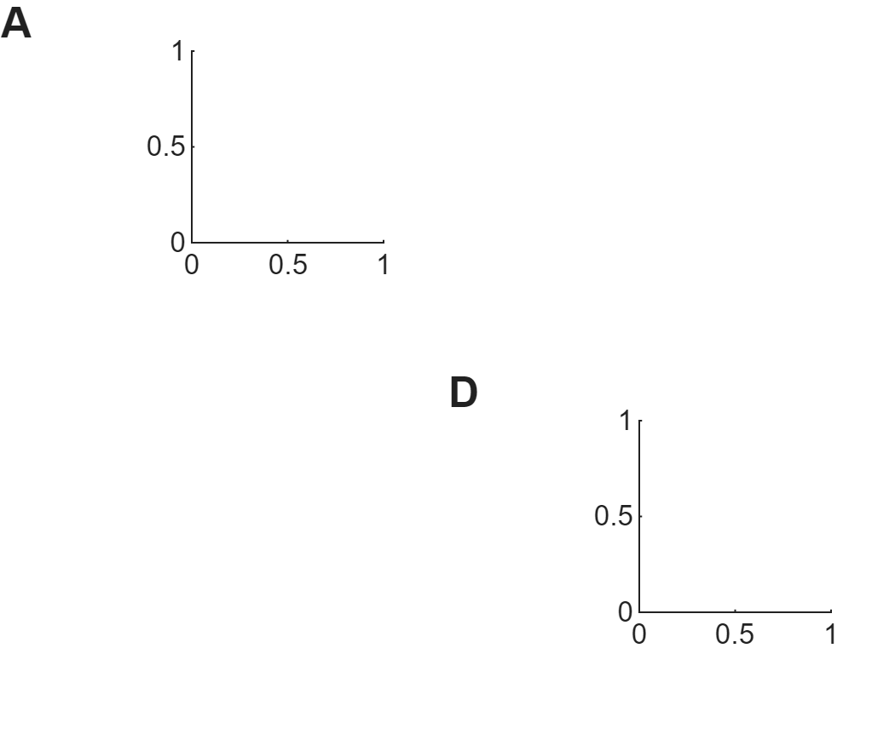

Padding craziness

```matlab
layout_subplots( ...
    panels_wide = 2, ...
    panels_high = 3, ...
    padding_left = [1 0.5 0.1 0.1 0.5 1]);
```

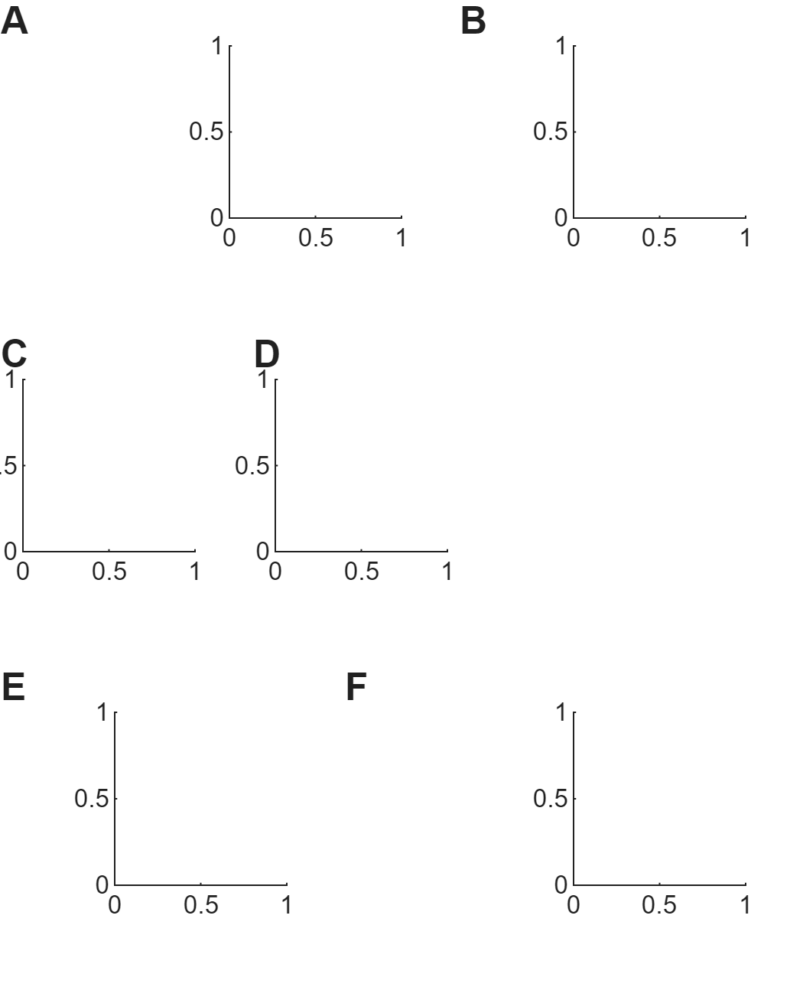

Change aspect ratio

```matlab
layout_subplots( ...
    panels_wide = 2, ...
    panels_high = 3, ...
    x_to_y_ratio = 3);
```

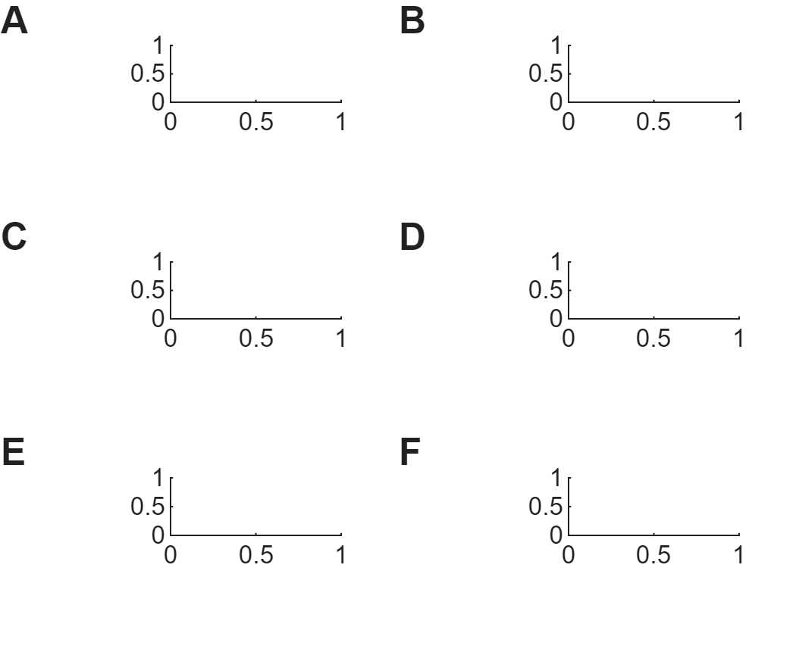
