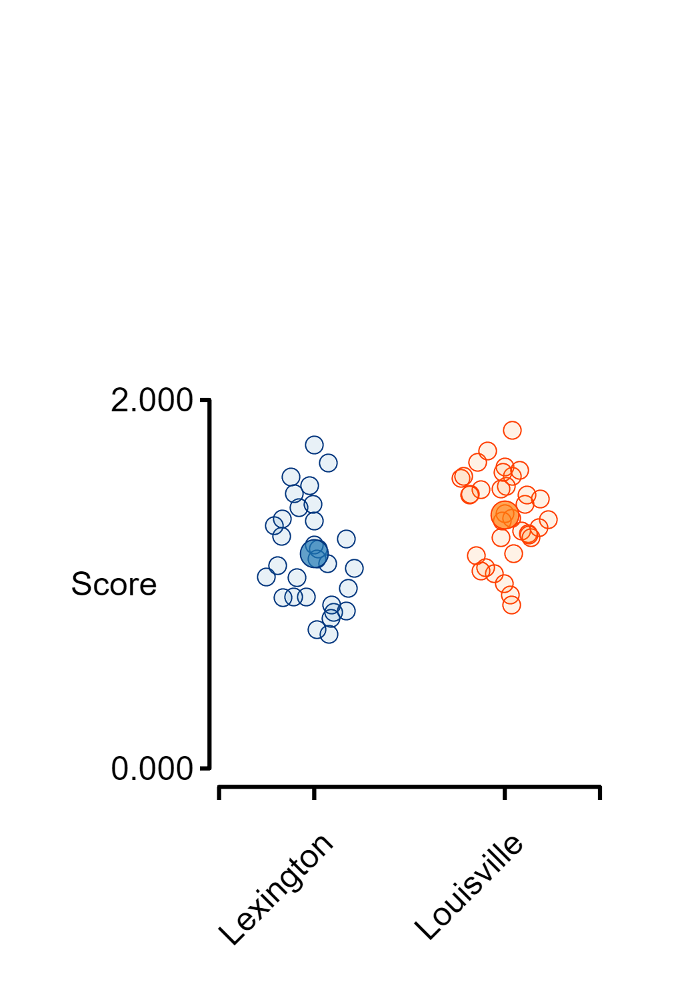
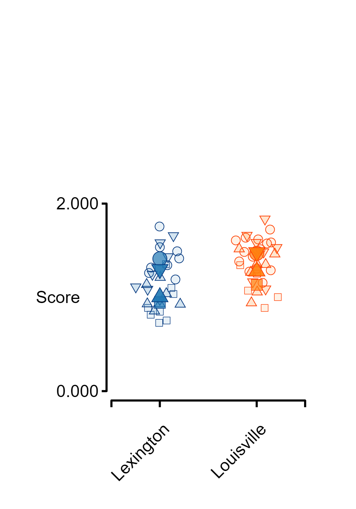
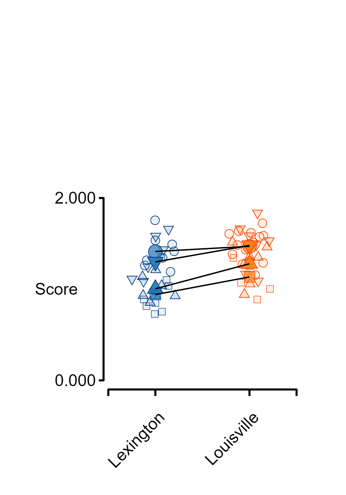
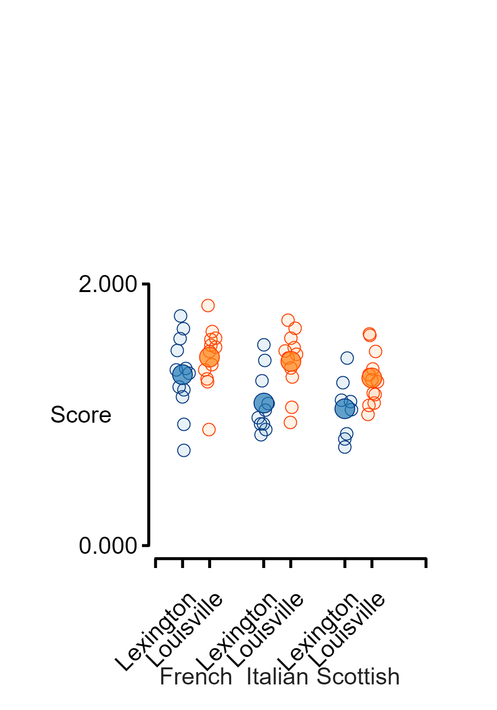
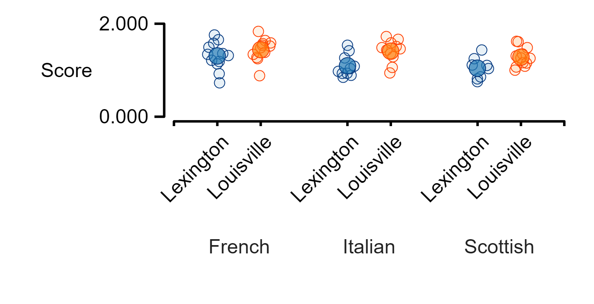
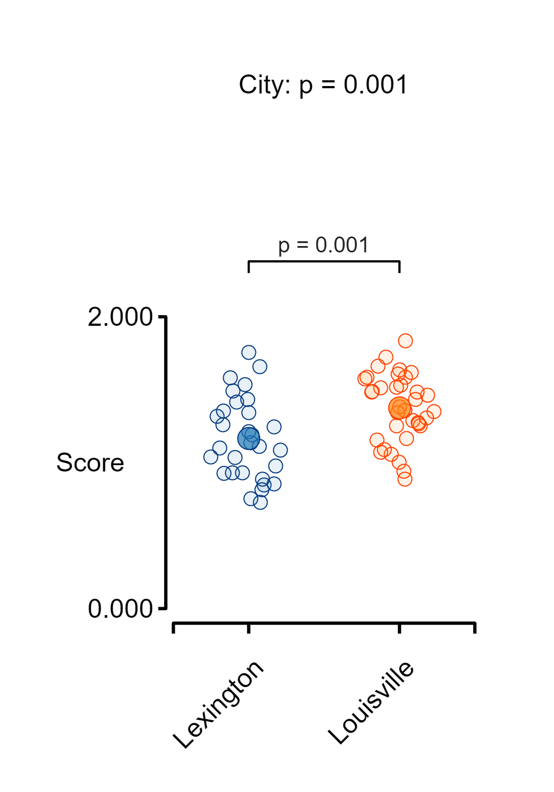
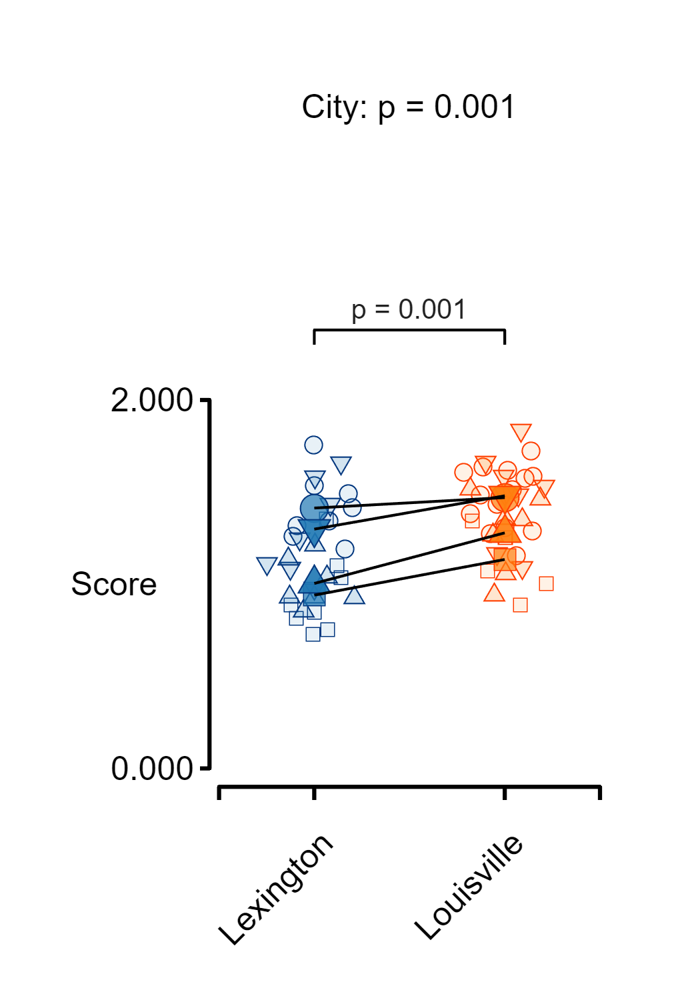
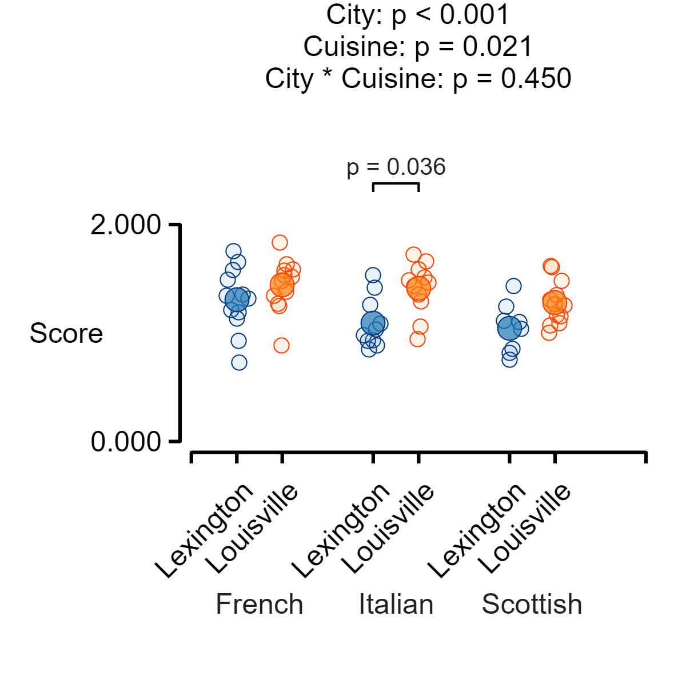
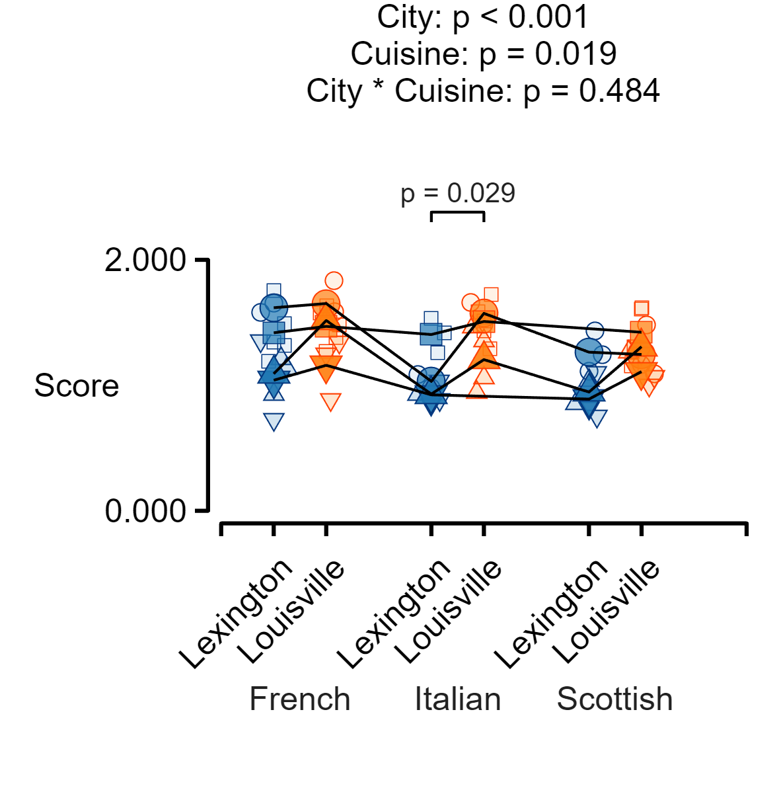

# Fig_jitter

[`fig_jitter.m`](../../../code/figures/fig_jitter/fig_jitter.html) creates figures that show raw data for one and two-way experimental designs with an optional grouping variable.subplots with well-defined sizes and positions in a figure. It can be useful for creating publication quality figures.

### Note on sizing

`fig_jitter()` creates figures with a default width of 3.5 inches. The images in this documentation will be resized by the browser and will likely appear at a different width. You can adjust the width of the figure by creating a subplot and passing the handle to `fig_jitter` - see examples.

### Source

This document was generated using a MATLAB live script
+ [`fig_jitter_live.mlx`](../../../../../demos/figures/fig_jitter/fig_jitter_live.mlx)


## Generate some data

```matlab
% Generate data with 2x2 design and a grouping variable
cities = ["Lexington", "Louisville"];
cuisines = ["Italian", "French", "Scottish"];
reviewers = ["Fiona", "Tucker", "Maggie", "Patterson"];

mean_scores = [1, 1.1, 1.05 ; 1.2, 1.3, 1.15];
noise = 0.2;
reviewer_effect = 0.1;

% Reset random generator for repeatility
rng(1);

% Loop through the table
counter = 0;
for i = 1 : numel(cities)
    for j = 1 : numel(cuisines)

        % Set a random number of scores
        n = 5 + randi(10, 1);
        vi = counter + (1:n);
        y(vi) = mean_scores(i,j) + (noise * (randn([n, 1]) - 0.5));
        city(vi) = repmat(cities(i), [n, 1]);
        cuisine(vi) = repmat(cuisines(j), [n, 1]);
        reviewer_ind = randi(numel(reviewers), [n, 1]);
        reviewer(vi) = reviewers(reviewer_ind);
        y(vi) = y(vi) + reviewer_effect * reviewer_ind';

        % Update counter for the next loop
        counter = counter + n;
    end
end

t = table(y', city', cuisine', reviewer', ...
        VariableNames = ["Score", "City", "Cuisine", "Reviewer"])
```

| |Score|City|Cuisine|Reviewer|
|:--:|:--:|:--:|:--:|:--:|
|1|1.5362|"Lexington"|"Italian"|"Patterson"|
|2|0.84831|"Lexington"|"Italian"|"Fiona"|
|3|0.97808|"Lexington"|"Italian"|"Maggie"|
|4|0.93089|"Lexington"|"Italian"|"Tucker"|
|5|1.0855|"Lexington"|"Italian"|"Maggie"|
|6|0.88826|"Lexington"|"Italian"|"Fiona"|
|7|1.0357|"Lexington"|"Italian"|"Fiona"|
|8|1.2606|"Lexington"|"Italian"|"Patterson"|
|9|1.4173|"Lexington"|"Italian"|"Patterson"|
|10|0.92962|"Lexington"|"Italian"|"Tucker"|
|snip|snip|snip|snip|snip|
|64|1.6183|"Louisville"|"Scottish"|"Patterson"|
|65|1.2666|"Louisville"|"Scottish"|"Tucker"|


## Create a one\-factor figure
```matlab
fig_jitter(t, "Score", "City");
```




## Create a one\-factor figure but no means
```matlab
fig_jitter(t, "Score", "City", ...
    super_plot = false);
```


## Create a one\-factor figure with grouping
```matlab
fig_jitter(t, "Score", "City", ...
    grouping_label = "Reviewer")
```




## Create a one\-factor figure with grouping and linkages shown
```matlab
fig_jitter(t, "Score", "City", ...
    grouping_label = "Reviewer", ...
    join_points = true)
```




## Create a two\-factor figure
```matlab
fig_jitter(t, "Score", "City", ...
    f2_label = "Cuisine")
```




## Adjust the figure size
```matlab

% Need to tweak the padding as well as the width to make sure
% labels fit
sub_plot = layout_subplots(figure_width = 5, ...
    x_to_y_ratio = 4, ...
    padding_left = 1.3, ...
    padding_bottom = 1.5);

% And here, need to adjust the y position of the f2 labels
fig_jitter(t, "Score", "City", ...
    f2_label = "Cuisine", ...
    subplot_handle = sub_plot, ...
    f2_label_rel_pos = -1.4)
```




## Calculate and show statistical results for one\-way table
```matlab
stats = linear_mixed_model(t, "Score", "City");
```

```matlabTextOutput
Warning: Ignoring 'CovariancePattern' parameter since the model has no random effects.
Warning: Ignoring 'CovariancePattern' parameter since the model has no random effects.
```

```matlab

fig_jitter(t, "Score", "City", ...
    title_string = stats.main_effects_string, ...
    post_hoc_table = stats.post_hoc)
```




## Calculate and show statistical results for one\-way table with grouping
```matlab
stats = linear_mixed_model(t, "Score", "City", ...
    grouping_label = "Reviewer");

fig_jitter(t, "Score", "City", ...
    grouping_label = "Reviewer", ...
    title_string = stats.main_effects_string, ...
    post_hoc_table = stats.post_hoc, ...
    join_points = true)
```




## Calculate and show statistical results for two\-way table
```matlab
stats = linear_mixed_model(t, "Score", "City", ...
    f2_label = "Cuisine");
```

```matlabTextOutput
Warning: Ignoring 'CovariancePattern' parameter since the model has no random effects.
Warning: Ignoring 'CovariancePattern' parameter since the model has no random effects.
```

```matlab

% Need to make the layout with big enough padding to
% show labels and results
sub_plot = layout_subplots(figure_width = 6, ...
    x_to_y_ratio = 2, ...
    padding_top = 2, ...
    padding_bottom = 2, ...
    padding_left = 1.5);

fig_jitter(t, "Score", "City", ...
    f2_label = "Cuisine", ...
    subplot_handle = sub_plot, ...
    title_string = stats.main_effects_string, ...
    post_hoc_table = stats.post_hoc, ...
    f2_label_rel_pos = -0.75)
```




## Calculate and show statistical results for two\-way table with grouping
```matlab
stats = linear_mixed_model(t, "Score", "City", ...
    f2_label = "Cuisine", ...
    grouping_label = "Reviewer");

% Need to make the layout with big enough padding to
% show labels and results
sub_plot = layout_subplots(figure_width = 6, ...
    x_to_y_ratio = 2, ...
    padding_top = 2, ...
    padding_bottom = 2, ...
    padding_left = 1.5);

fig_jitter(t, "Score", "City", ...
    f2_label = "Cuisine", ...
    grouping_label = "Reviewer", ...
    subplot_handle = sub_plot, ...
    title_string = stats.main_effects_string, ...
    post_hoc_table = stats.post_hoc, ...
    join_points = true, ...
    f2_label_rel_pos = -0.75)
```


