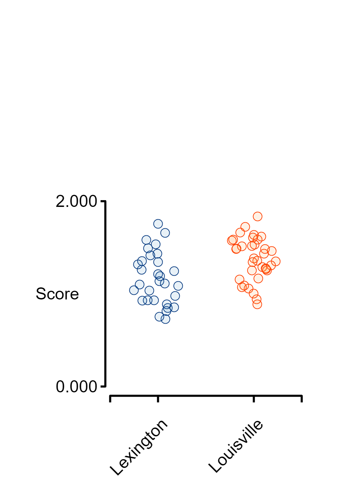
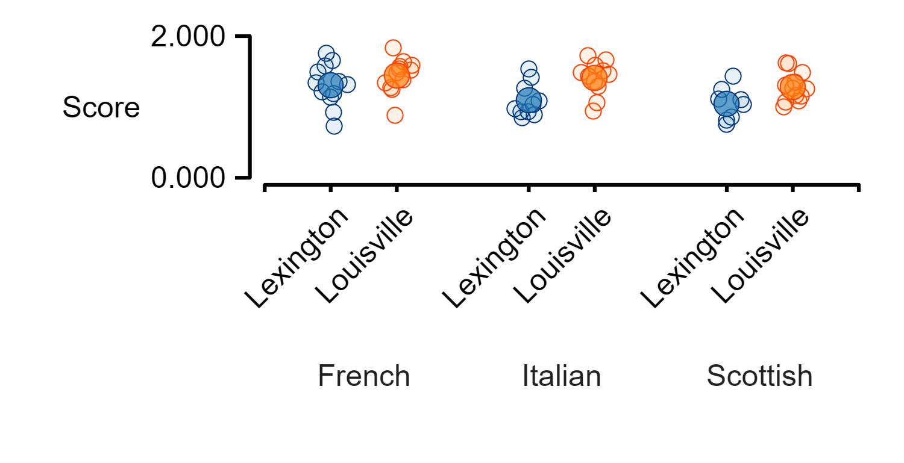
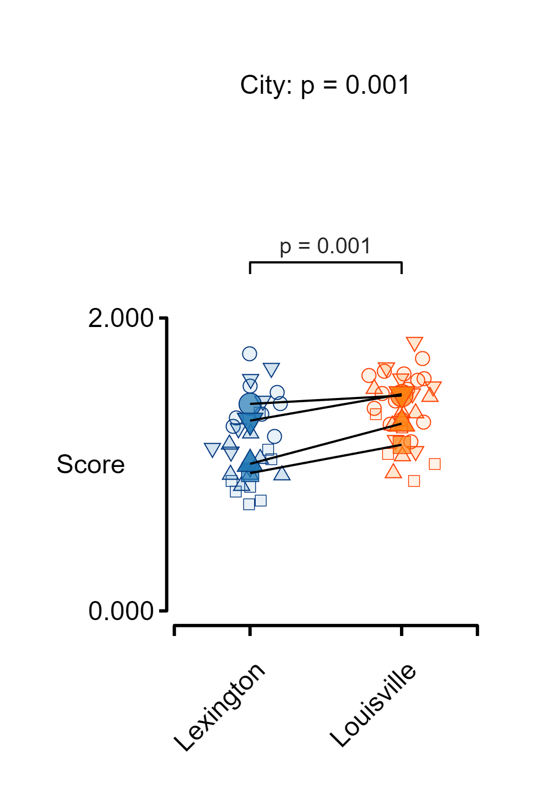
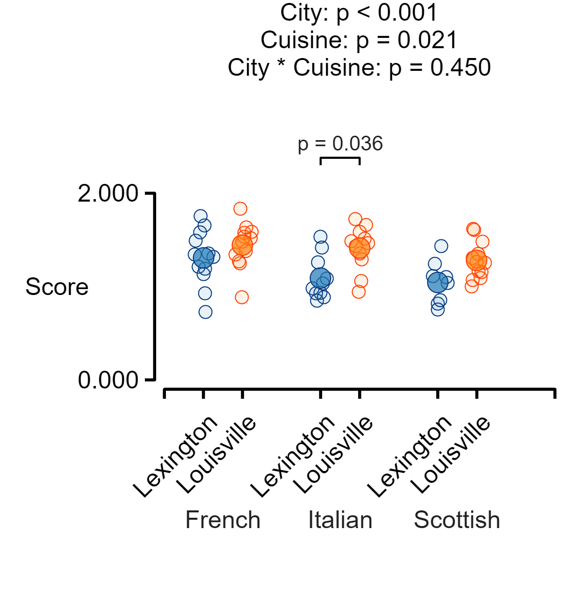

## Generate some data
```matlab
% Generate data with 2x2 design and a grouping variable
cities = ["Lexington", "Louisville"];
cuisines = ["Italian", "French", "Scottish"];
reviewers = ["Fiona", "Tucker", "Maggie", "Patterson"];

mean_scores = [1, 1.1, 1.05 ; 1.2, 1.3, 1.15];
noise = 0.2;
reviewer_effect = 0.1;

% Reset random generator for repeatility
rng(1);

% Loop through the table
counter = 0;
for i = 1 : numel(cities)
    for j = 1 : numel(cuisines)

        % Set a random number of scores
        n = 5 + randi(10, 1);
        vi = counter + (1:n);
        y(vi) = mean_scores(i,j) + (noise * (randn([n, 1]) - 0.5));
        city(vi) = repmat(cities(i), [n, 1]);
        cuisine(vi) = repmat(cuisines(j), [n, 1]);
        reviewer_ind = randi(numel(reviewers), [n, 1]);
        reviewer(vi) = reviewers(reviewer_ind);
        y(vi) = y(vi) + reviewer_effect * reviewer_ind';

        % Update counter for the next loop
        counter = counter + n;
    end
end

t = table(y', city', cuisine', reviewer', ...
        VariableNames = ["Score", "City", "Cuisine", "Reviewer"])
```


| |Score|City|Cuisine|Reviewer|
|:--:|:--:|:--:|:--:|:--:|
|1|1.5362|"Lexington"|"Italian"|"Patterson"|
|2|0.84831|"Lexington"|"Italian"|"Fiona"|
|3|0.97808|"Lexington"|"Italian"|"Maggie"|
|4|0.93089|"Lexington"|"Italian"|"Tucker"|
|5|1.0855|"Lexington"|"Italian"|"Maggie"|
|6|0.88826|"Lexington"|"Italian"|"Fiona"|
|7|1.0357|"Lexington"|"Italian"|"Fiona"|
|8|1.2606|"Lexington"|"Italian"|"Patterson"|
|9|1.4173|"Lexington"|"Italian"|"Patterson"|
|10|0.92962|"Lexington"|"Italian"|"Tucker"|
|11|1.6563|"Lexington"|"French"|"Maggie"|
|12|1.7547|"Lexington"|"French"|"Patterson"|
|13|0.72698|"Lexington"|"French"|"Fiona"|
|14|1.1898|"Lexington"|"French"|"Patterson"|
|15|1.3165|"Lexington"|"French"|"Patterson"|
|16|1.5804|"Lexington"|"French"|"Maggie"|
|17|0.92645|"Lexington"|"French"|"Tucker"|
|18|1.3415|"Lexington"|"French"|"Patterson"|
|19|1.3542|"Lexington"|"French"|"Fiona"|
|20|1.2132|"Lexington"|"French"|"Tucker"|
|21|1.4903|"Lexington"|"French"|"Patterson"|
|22|1.1356|"Lexington"|"French"|"Tucker"|
|23|0.81572|"Lexington"|"Scottish"|"Fiona"|
|24|1.1129|"Lexington"|"Scottish"|"Maggie"|
|25|1.4352|"Lexington"|"Scottish"|"Maggie"|
|26|0.75366|"Lexington"|"Scottish"|"Fiona"|
|27|1.0384|"Lexington"|"Scottish"|"Tucker"|
|28|1.2443|"Lexington"|"Scottish"|"Maggie"|
|29|0.85474|"Lexington"|"Scottish"|"Tucker"|
|30|1.1018|"Lexington"|"Scottish"|"Fiona"|
|31|1.3566|"Louisville"|"Italian"|"Tucker"|
|32|1.5127|"Louisville"|"Italian"|"Patterson"|
|33|1.4867|"Louisville"|"Italian"|"Maggie"|
|34|1.5846|"Louisville"|"Italian"|"Patterson"|
|35|1.6599|"Louisville"|"Italian"|"Maggie"|
|36|1.29|"Louisville"|"Italian"|"Patterson"|
|37|0.94272|"Louisville"|"Italian"|"Tucker"|
|38|1.4632|"Louisville"|"Italian"|"Tucker"|
|39|1.4344|"Louisville"|"Italian"|"Patterson"|
|40|1.0571|"Louisville"|"Italian"|"Tucker"|
|41|1.7224|"Louisville"|"Italian"|"Patterson"|
|42|1.5328|"Louisville"|"French"|"Maggie"|
|43|1.2727|"Louisville"|"French"|"Patterson"|
|44|1.5163|"Louisville"|"French"|"Tucker"|
|45|1.5742|"Louisville"|"French"|"Patterson"|
|46|1.5866|"Louisville"|"French"|"Maggie"|
|47|1.251|"Louisville"|"French"|"Fiona"|
|48|1.3829|"Louisville"|"French"|"Patterson"|
|49|1.8362|"Louisville"|"French"|"Maggie"|
|50|1.6353|"Louisville"|"French"|"Patterson"|
|51|0.88571|"Louisville"|"French"|"Fiona"|
|52|1.3422|"Louisville"|"French"|"Fiona"|
|53|1.4834|"Louisville"|"French"|"Patterson"|
|54|1.1663|"Louisville"|"Scottish"|"Maggie"|
|55|1.609|"Louisville"|"Scottish"|"Patterson"|
|56|1.2535|"Louisville"|"Scottish"|"Fiona"|
|57|1.3489|"Louisville"|"Scottish"|"Tucker"|
|58|1.4828|"Louisville"|"Scottish"|"Maggie"|
|59|1.308|"Louisville"|"Scottish"|"Patterson"|
|60|1.0886|"Louisville"|"Scottish"|"Maggie"|
|61|1.0017|"Louisville"|"Scottish"|"Fiona"|
|62|1.1565|"Louisville"|"Scottish"|"Patterson"|
|63|1.0717|"Louisville"|"Scottish"|"Fiona"|
|64|1.6183|"Louisville"|"Scottish"|"Patterson"|
|65|1.2666|"Louisville"|"Scottish"|"Tucker"|


## Create a one\-factor figure
```matlab
fig_jitter(t, "Score", "City");
```

<center></center>


## Create a one\-factor figure but no means
```matlab
fig_jitter(t, "Score", "City", ...
    super_plot = false);
```

<center></center>


## Create a one\-factor figure with grouping
```matlab
fig_jitter(t, "Score", "City", ...
    grouping_label = "Reviewer")
```

<center></center>


## Create a one\-factor figure with grouping and linkages shown
```matlab
fig_jitter(t, "Score", "City", ...
    grouping_label = "Reviewer", ...
    join_points = true)
```

<center></center>


## Create a two\-factor figure
```matlab
fig_jitter(t, "Score", "City", ...
    f2_label = "Cuisine")
```

<center></center>


## Adjust the figure size
```matlab
sub_plot = layout_subplots(figure_width = 5, ...
    x_to_y_ratio = 4, ...
    padding_left = 1.3, ...
    padding_bottom = 1.5);

fig_jitter(t, "Score", "City", ...
    f2_label = "Cuisine", ...
    subplot_handle = sub_plot, ...
    f2_label_rel_pos = -1.4)
```

<center></center>


## Calculate and show statistical results for one\-way table
```matlab
stats = linear_mixed_model(t, "Score", "City");
```

```matlabTextOutput
Warning: Ignoring 'CovariancePattern' parameter since the model has no random effects.
Warning: Ignoring 'CovariancePattern' parameter since the model has no random effects.
```

```matlab

fig_jitter(t, "Score", "City", ...
    title_string = stats.main_effects_string, ...
    post_hoc_table = stats.post_hoc)
```

<center></center>


## Calculate and show statistical results for one\-way table with grouping
```matlab
stats = linear_mixed_model(t, "Score", "City", ...
    grouping_label = "Reviewer");

fig_jitter(t, "Score", "City", ...
    grouping_label = "Reviewer", ...
    title_string = stats.main_effects_string, ...
    post_hoc_table = stats.post_hoc, ...
    join_points = true)
```

<center></center>


## Calculate and show statistical results for two\-way table
```matlab
stats = linear_mixed_model(t, "Score", "City", ...
    f2_label = "Cuisine");
```

```matlabTextOutput
Warning: Ignoring 'CovariancePattern' parameter since the model has no random effects.
Warning: Ignoring 'CovariancePattern' parameter since the model has no random effects.
```

```matlab

% Need to make the layout with big enough padding to
% show labels and results
sub_plot = layout_subplots(figure_width = 6, ...
    x_to_y_ratio = 2, ...
    padding_top = 2, ...
    padding_bottom = 2, ...
    padding_left = 1.5);

fig_jitter(t, "Score", "City", ...
    f2_label = "Cuisine", ...
    subplot_handle = sub_plot, ...
    title_string = stats.main_effects_string, ...
    post_hoc_table = stats.post_hoc, ...
    f2_label_rel_pos = -0.75)
```

<center></center>


## Calculate and show statistical results for two\-way table with grouping
```matlab
stats = linear_mixed_model(t, "Score", "City", ...
    f2_label = "Cuisine", ...
    grouping_label = "Reviewer");

% Need to make the layout with big enough padding to
% show labels and results
sub_plot = layout_subplots(figure_width = 6, ...
    x_to_y_ratio = 2, ...
    padding_top = 2, ...
    padding_bottom = 2, ...
    padding_left = 1.5);

fig_jitter(t, "Score", "City", ...
    f2_label = "Cuisine", ...
    grouping_label = "Reviewer", ...
    subplot_handle = sub_plot, ...
    title_string = stats.main_effects_string, ...
    post_hoc_table = stats.post_hoc, ...
    join_points = true, ...
    f2_label_rel_pos = -0.75)
```

<center></center>

