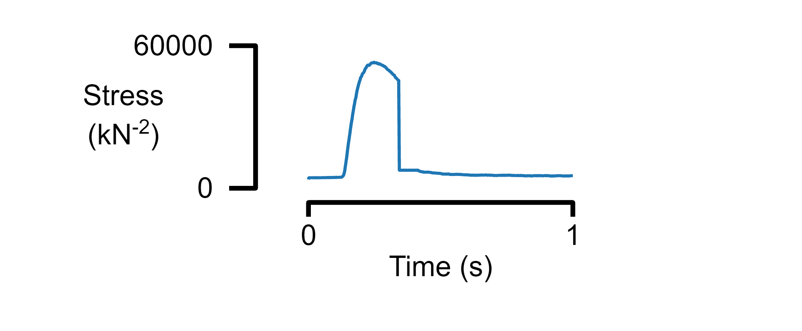
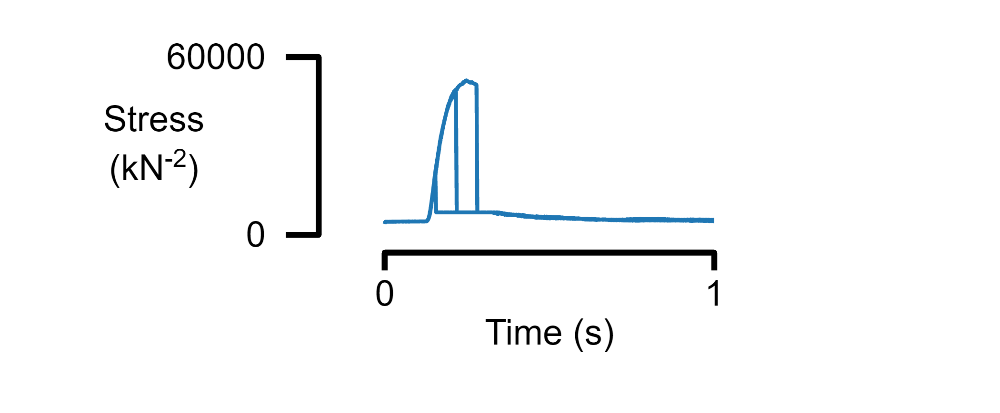
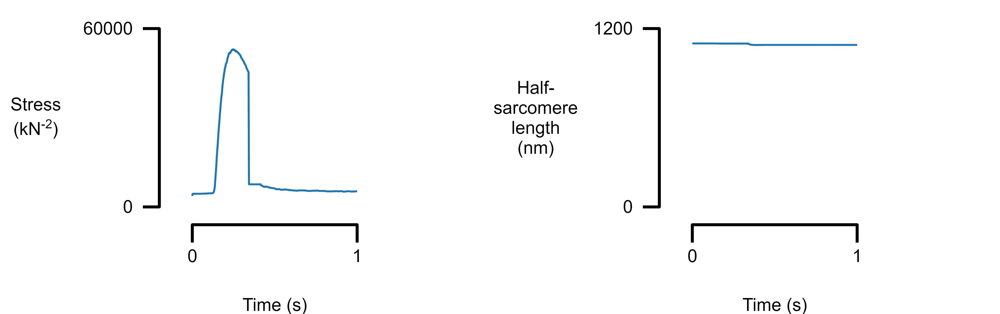
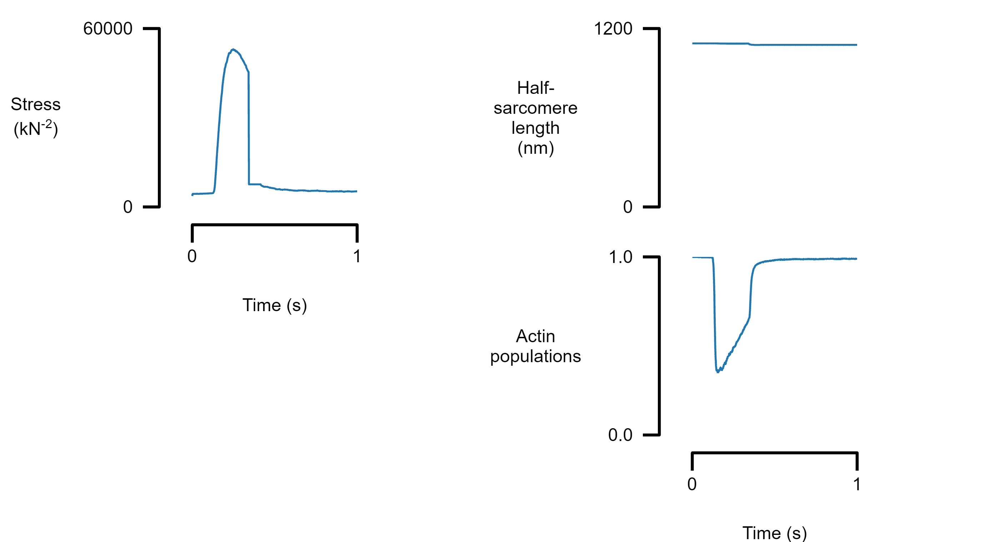
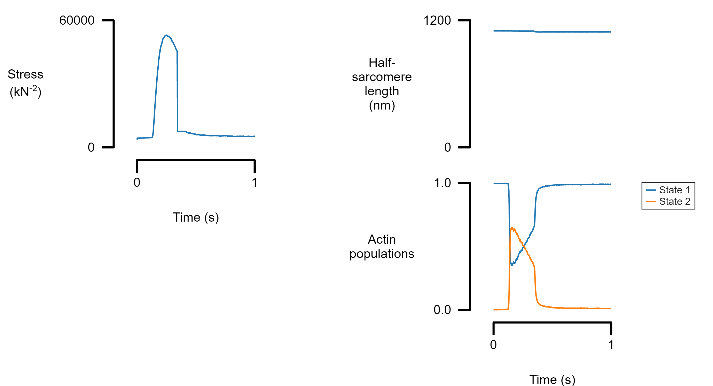

# Fig_multi_x

[`fig_multi_x.m`](../../../code/figures/fig_multi_x/fig_multi_x.html) creates a figure that shows one or more columns of a table plotted against another column. The formatting and arrangement of the figure is defined in a separate file provided by the user in JSON format.

### Source

Parts of this document were generated using a MATLAB live script
+ [`fig_multi_x_live.mlx`](../../../../../demos/figures/fig_multi_x/fig_multi_x.mlx)


### Preliminaries

```matlab
% View an example table
single_data_file = "data/sim_prot_1_7_r1.txt";
d = readtable(data_file_string)
```

| |time|m_length|m_force|sc_extension|sc_force|hs_1_pCa|hs_1_length|hs_1_command_length|hs_1_slack_length|hs_1_a_length|hs_1_m_length|hs_1_force|hs_1_titin_force|hs_1_viscous_force|hs_1_extracellular_force|hs_1_inter_hs_titin_force_effect|hs_1_a_pop_1|hs_1_a_pop_2|hs_1_m_pop_1|hs_1_m_pop_2|hs_1_m_pop_3|hs_1_m_pop_4|hs_1_c_pop_1|hs_1_c_pop_2|hs_1_c_pop_3|
|:--:|:--:|:--:|:--:|:--:|:--:|:--:|:--:|:--:|:--:|:--:|:--:|:--:|:--:|:--:|:--:|:--:|:--:|:--:|:--:|:--:|:--:|:--:|:--:|:--:|:--:|
|1|0.001|1100|3685.3|0.073707|3685.3|9.23|1099.9|1100|NaN|1015.9|809.12|3685.3|4420.5|-737.07|0|0|1|0|0.93499|0.065008|0|0|1|0|0|
|2|0.002|1100|4298|0.08596|4298|8.93|1099.9|1100|NaN|1015.9|809.12|4298|4420.2|-122.53|0|0|1|0|0.88513|0.11487|0|0|1|0|0|
|3|0.003|1100|4399.9|0.087997|4399.9|8.76|1099.9|1100|NaN|1015.9|809.12|4399.9|4420.2|-20.37|0|0|0.99986|0.00014468|0.8506|0.1494|0|0|1|0|0|
|4|0.004|1100|4416.8|0.088336|4416.8|8.64|1099.9|1100|NaN|1015.9|809.12|4416.8|4420.2|-3.3865|0|0|0.99971|0.00028935|0.82398|0.17602|0|0|1|0|0|
|5|0.005|1100|4419.6|0.088392|4419.6|8.54|1099.9|1100|NaN|1015.9|809.12|4419.6|4420.2|-0.56299|0|0|1|0|0.80064|0.19936|0|0|1|0|0|
|6|0.006|1100|4420.1|0.088401|4420.1|8.47|1099.9|1100|NaN|1015.9|809.12|4420.1|4420.2|-0.093594|0|0|0.99986|0.00014468|0.78868|0.21132|0|0|1|0|0|
|7|0.007|1100|4420.1|0.088403|4420.1|8.41|1099.9|1100|NaN|1015.9|809.12|4420.1|4420.2|-0.01556|0|0|0.99957|0.00043403|0.77758|0.22242|0|0|1|0|0|
|8|0.008|1100|4420.2|0.088403|4420.2|8.35|1099.9|1100|NaN|1015.9|809.12|4420.2|4420.2|-0.0025868|0|0|0.99957|0.00043403|0.76553|0.23447|0|0|1|0|0|
|9|0.009|1100|4420.2|0.088403|4420.2|8.31|1099.9|1100|NaN|1015.9|809.12|4420.2|4420.2|-0.00043258|0|0|0.99957|0.00043403|0.75309|0.24691|0|0|1|0|0|
|10|0.01|1100|4420.2|0.088403|4420.2|8.26|1099.9|1100|NaN|1015.9|809.12|4420.2|4420.2|-6.9858e-05|0|0|0.99899|0.0010127|0.74817|0.25183|0|0|1|0|0|
|11|0.011|1100|4420.2|0.088403|4420.2|8.23|1099.9|1100|NaN|1015.9|809.12|4420.2|4420.2|-1.1305e-05|0|0|0.99913|0.00086806|0.74093|0.25907|0|0|1|0|0|
|12|0.012|1100|4420.2|0.088403|4420.2|8.19|1099.9|1100|NaN|1015.9|809.12|4420.2|4420.2|-1.9008e-06|0|0|0.99913|0.00086806|0.73708|0.26292|0|0|1|0|0|
|13|0.013|1100|4420.2|0.088403|4420.2|8.16|1099.9|1100|NaN|1015.9|809.12|4420.2|4420.2|-3.8426e-07|0|0|0.99913|0.00086806|0.73293|0.26707|0|0|1|0|0|
|14|0.014|1100|4420.2|0.088403|4420.2|8.14|1099.9|1100|NaN|1015.9|809.12|4420.2|4420.2|-1.0232e-07|0|0|0.99884|0.0011574|0.73052|0.26948|0|0|1|0|0|


```matlab
% View a simple template
template_file_1 = "templates/template_1.json";
t = readstruct(template_file_1)
```

```matlabTextOutput
t = struct with fields:
        layout: [1x1 struct]
     x_display: [1x1 struct]
    formatting: [1x1 struct]
        panels: [1x1 struct]
```

[Link to the template 1 file](../../../../../demos/figures/fig_multi_x/templates/template_1.json)


```
{
    "layout":
    {
        "fig_width": 3.5,
        "padding_left": 1,
        "padding_right": 1,
        "padding_top": [0.2, 0.05],
        "padding_bottom": [0.05, 0.5],
        "x_to_y_ratio": 2
    },
    "x_display":{
        "global_x_field": "time",
        "label": "Time (s)"
    },
    "formatting":
    {
        "label_font_size": 9,
        "x_axis_offset": 0.1,
        "x_label_offset": -0.45,
        "x_tick_length": 0.1,
        "x_tick_label_vertical_offset": -0.12,
        "y_axis_offset": 0.2,
        "y_label_offset": -0.5,
        "y_tick_length": 0.1,
        "y_tick_label_horizontal_offset": -0.16,
        "tick_font_size": 9,
        "legend_font_size": 7,
        "legend_alignment": "top_left",
        "legend_position": [1.2, 1.0]        
    },
    "panels":
    [
        {
            "column": 1,
            "y_info":
            {
                "label": "Stress\n(kN^{-2})",
                "series":
                [
                    
                    {
                        "field": "m_force"
                    }
                ]
            }
        }
    ]
}
```

### A single panel figure

```matlab
% Create a figure
figure_multi_x(single_data_file, template_file_1)
```



### Plot data from multiple files on a single panel

```matlab
% Plot three tables with the same format
multiple_data_files = [ ...
    "data/sim_prot_1_1_r1.txt", ...
    "data/sim_prot_1_3_r1.txt", ...
    "data/sim_prot_1_5_r1.txt"];

figure_multi_x(multiple_data_files, template_file_1)
```




### Plot multiple panels

Add new panels to the figure by inserting new elements into the panel array. The column variable defines where the panel will be placed.

```matlab
template_file_2 = "templates/template_2.json";

figure_multi_x(single_data_file, template_file_2)
```

[Link to the template 2 file](../../../../../demos/figures/fig_multi_x/templates/template_2.json)

```
{
    <SNIP>

    "panels":
    [
        {
            "column": 1,
            "y_info":
            {
                "label": "Stress\n(kN^{-2})",
                "series":
                [
                    {
                        "field": "m_force"
                    }
                ]
            }
        },
        {
            "column": 2,
            "y_info":
            {
                "label": "Half-\nsarcomere\nlength\n(nm)",
                "series":
                [                    
                    {
                        "field": "hs_1_length"
                    }
                ]
            }
        }
    ]
}
```



### Plot multiple rows

Add another panel to column 2 by inserting a new element with the appropriate column label. Only the bottom panel in each column shows the x axis.

[Link to the template 3 file](../../../../../demos/figures/fig_multi_x/templates/template_3.json)

```matlab
template_file_3 = "templates/template_3.json";

figure_multi_x(single_data_file, template_file_3)
```

```
{
    <SNIP>

    "panels":
    [
        {
            "column": 1,
            "y_info":
            {
                "label": "Stress\n(kN^{-2})",
                "series":
                [
                    {
                        "field": "m_force"
                    }
                ]
            }
        },
        {
            "column": 2,
            "y_info":
            {
                "label": "Half-\nsarcomere\nlength\n(nm)",
                "series":
                [                    
                    {
                        "field": "hs_1_length"
                    }
                ]
            }
        },
        {
            "column": 2,
            "y_info":
            {
                "label": "Actin\npopulations",
                "series":
                [
                    
                    {
                        "field": "hs_1_a_pop_1"
                    }
                ]
            }
        }
    ]
}
```



### Plot multiple traces from the same data file

Each panel can show more than one trace. If a `field_label` is provided, a legend will be added to the panel.

[Link to the template 4 file](../../../../../demos/figures/fig_multi_x/templates/template_4.json)

```matlab
template_file_4 = "templates/template_4.json";

figure_multi_x(single_data_file, template_file_4)
```

```
{

    <snip>

    "panels":
    [
        <snip>
         {
            "column": 2,
            "y_info":
            {
                "label": "Actin\npopulations",
                "series":
                [
                    
                    {
                        "field": "hs_1_a_pop_1",
                        "field_label": "State 1"
                    },
                    {
                        "field": "hs_1_a_pop_2",
                        "field_label": "State 2"
                    }
                ]
            }
        }
    ]
}
```



### Plotting a multi panel results for a publication

With this:
+ [data file](../../../../../demos/figures/fig_multi_x/data/sim_output.txt)
+ [template file](../../../../../demos/figures/fig_multi_x/data/template_example_growth.json)

```
figure_multi_x(data_file, template_file)
```


