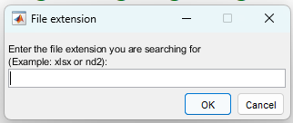
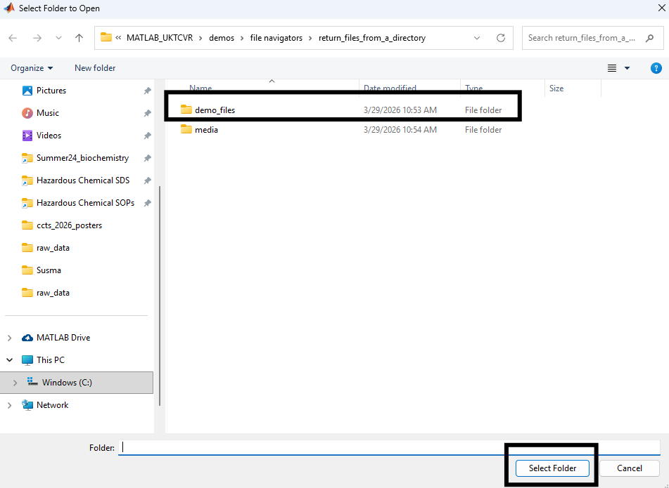
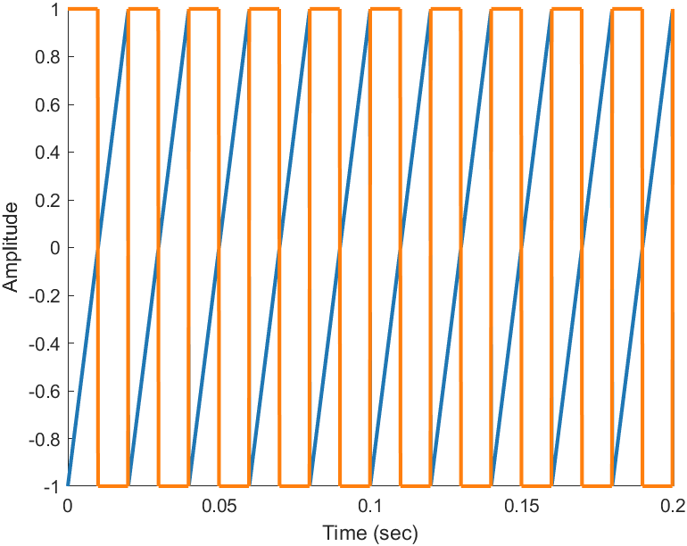

```matlab
% Let's create some data and save them in Excel files.
% The following pulse waves are taken from
% https://www.mathworks.com/help/signal/ug/signal-generation-and-visualization.html

fs = 10000;
t = 0:1/fs:1.5;
out.pulse_1.time = t';
out.pulse_2.time = t';
out.pulse_1.data = sawtooth(2*pi*50*out.pulse_1.time)
out.pulse_2.data = square(2*pi*50*out.pulse_2.time)

for i = 1 : 2
    var = sprintf('pulse_%i',i);
    out_table = struct2table(out.(var));
    output_file_name = sprintf('demo_files/%s.xlsx',var);
    % Overwriting the old file
    try
        delete(output_file_name)
    end
    writetable(out_table,output_file_name)
end

```

Generated files are stored under the specified folder:


```matlab
% Now let's look for Excel files and plot them.

file_list = return_files_from_a_directory
```

First, a dialog box appears and prompts user to input the extension of the files of interest.



Then, select your folder;



The return_files_from_a_directory function returns the list of all the files with entered extension.

```matlabTextOutput
file_list =

  2×1 cell array

    {'C:\Utku\MATLAB_UKTCVR\demos\file navigators\return_files_from_a_directory\demo_files\pulse_1.xlsx'}
    {'C:\Utku\MATLAB_UKTCVR\demos\file navigators\return_files_from_a_directory\demo_files\pulse_2.xlsx'}
```

```matlab
% Let's take a look at the data.

d = readtable(file_list{1})
```

```matlabTextOutput

d =

  15001×2 table

     time     data 
    ______    _____

         0       -1
    0.0001    -0.99
    0.0002    -0.98
    0.0003    -0.97
    0.0004    -0.96

      :         :  

    1.4996     0.96
    1.4997     0.97
    1.4998     0.98
    1.4999     0.99
       1.5       -1

```

Please keep in mind that the following bit is unique for each application. But the principles are the same. First find the files, then read the files with Matlab, parse it out, and perform desired task.

```matlab
% Let's plot and save the figure.
col = return_matplotlib_default_colors;

for i = 1 : numel(file_list)

    d = [];
    
    d = readtable(file_list{i});

    hold on
    figure(1)
    plot(d.time,d.data,'Color',col(i,:),'LineWidth',2)
    xlim([0 0.2])
    xlabel("Time (sec)")
    ylabel("Amplitude")

end

exportgraphics(gcf,'media/return_files_from_a_directory_and_use_them.png')
```




