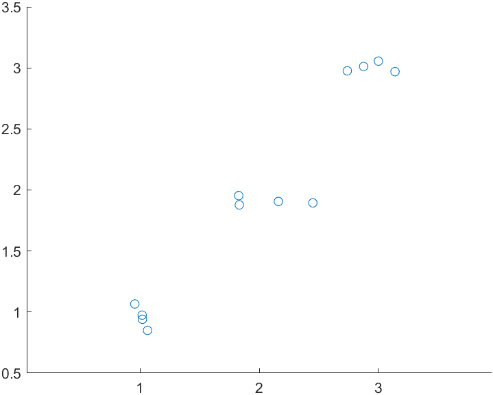
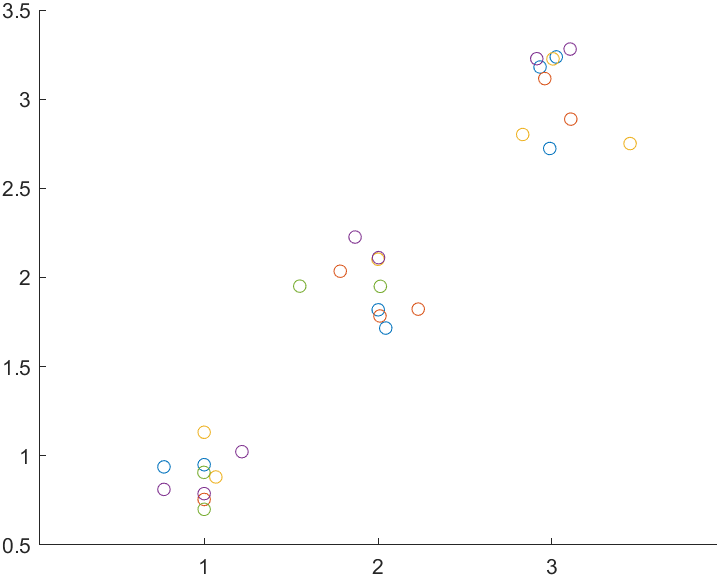
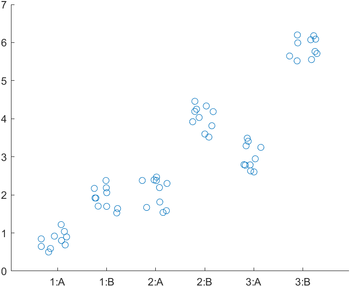
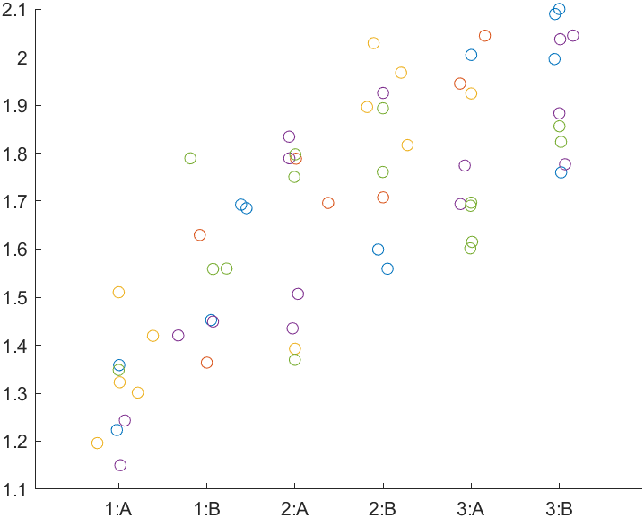

# Linear mixed model

## Overview
{: .no_toc}

[`linear_mixed_model.m`](../../../code/statistics/linear_mixed_model/linear_mixed_model.html) fits one-way or two-way linear mixed models to data with an optional grouping variable.

`linear_mixed_model.m` has an option to create simple [swarmcharts](https://www.mathworks.com/help/matlab/ref/swarmchart.html) that illustrate the data but the plots do not show statistical effects.

[`fig_jitter.m`](../../../code/figures/fig_jitter/fig_jitter.m) can be used in combination with `linear_mixed_model.m` to make publication-quality figures.

* * *

## One-way

Without a grouping variable, a linear-mixed model is similar to a standard ANOVA.

### Code

[`linear_mixed_model_one_way.m`](../../../../../demos/statistics/linear_mixed_model/linear_mixed_model_one_way.m)

```
function linear_mixed_model_one_way

% Create data
n_f1 = 3;
n = 4;
noise = 0.3;
for i = 1 : n_f1
    vi = (i-1)*n+(1:n);
    y(vi) = i;
    f1(vi) = repmat(sprintf("%.i", i), [1, n]);
end
% Add some jitter, resetting randumber generator for consistency
rng(1)
y = y + noise * (rand(size(y)) - 0.5);

% Form the table
t = table(y', f1', VariableNames = ["y", "Block"]);

% Run the stats test
stats = linear_mixed_model(t, "y", "Block", figure_handle = 1)

me = stats.main_effects
pc = stats.post_hoc
ms = stats.model_string
mes = stats.main_effects_string
```

### Output

```
>> linear_mixed_model_one_way
Warning: Ignoring 'CovariancePattern' parameter since the model has no random effects. 
> In classreg.regr.LinearLikeMixedModel.validateCovariancePattern (line 1617)
In LinearMixedModel.fit (line 2392)
In fitlme (line 233)
In linear_mixed_model (line 39)
In demo_statistics_linear_mixed_model_one_way (line 20) 
Warning: Ignoring 'CovariancePattern' parameter since the model has no random effects. 
> In classreg.regr.LinearLikeMixedModel.validateCovariancePattern (line 1617)
In LinearMixedModel.fit (line 2392)
In fitlme (line 233)
In linear_mixed_model (line 45)
In demo_statistics_linear_mixed_model_one_way (line 20) 
stats = 
  struct with fields:

           main_effects: [1×5 classreg.regr.lmeutils.titleddataset]
               post_hoc: [3×7 table]
           model_string: "y ~ 1 + Block"
    main_effects_string: "Block: p < 0.001"
me = 

    ANOVA marginal tests: DFMethod = 'Satterthwaite'

    Term             FStat    DF1    DF2    pValue    
    {'Block'}        1183     2      9      1.2696e-11
pc =
  3×7 table
    varname_1    varname_2      p_raw         F       df1    df2    p_corrected
    _________    _________    __________    ______    ___    ___    ___________
       "1"          "3"       3.3142e-12      2362     1      9     9.9427e-12 
       "3"          "2"        8.802e-10    677.41     1      9     1.7604e-09 
       "1"          "2"       3.1151e-09    509.54     1      9     3.1151e-09 
ms = 
    "y ~ 1 + Block"
mes = 
    "Block: p < 0.001"
>> 
```
 
)

### Comments

+ MATLAB prints a warning because `linear_mixed_model.m` is called using an option that only makes sense if there is a grouping variable. You can ignore this warning for the demo but you should also realize that you are running a test that could be done more simply using a standard one-way ANOVA.

+ The post-hoc table is ordered by the p_corrected column which uses a Holm-Bonferroni approach.

+ The plot is ultra-simple and is intended mainly to help visualize the data.

* * *


## One-way with grouping

This example builds on the last but adds a grouping variable

### Code

[`linear_mixed_model_one_way_with_grouping.m`](../../../../../demos/statistics/linear_mixed_model/linear_mixed_model_one_way_with_grouping.m)

```
function linear_mixed_model_one_way_with_grouping

% Create data
n_f1 = 3;
n = 10;
noise = 0.6;
for i = 1 : n_f1
    vi = (i-1)*n+(1:n);
    y(vi) = i;
    f1(vi) = repmat(sprintf("%.i", i), [1, n]);
end
% Add some jitter, resetting randumber generator for consistency
rng(1)
y = y + noise * (rand(size(y)) - 0.5);

% Add a grouping variable
g = randi(5, size(y));

% Form the table
t = table(y', f1', g', VariableNames = ["y", "Block", "ID"]);

% Run the stats test
stats = linear_mixed_model(t, "y", "Block", ...
    grouping_label = "ID", ...
    figure_handle = 1)

% Expand the output
me = stats.main_effects
pc = stats.post_hoc
ms = stats.model_string
mes = stats.main_effects_string

% Save the figure
exportgraphics(gcf, 'one_way_with_grouping.png')
```

### Output

```
stats = 
  struct with fields:

           main_effects: [1×5 classreg.regr.lmeutils.titleddataset]
               post_hoc: [3×7 table]
           model_string: "y ~ 1 + Block + (1 | ID)"
    main_effects_string: "Block: p < 0.001"
me = 

    ANOVA marginal tests: DFMethod = 'Satterthwaite'

    Term             FStat     DF1    DF2      pValue    
    {'Block'}        376.18    2      25.58    1.0756e-19
pc =
  3×7 table
    varname_1    varname_2      p_raw         F       df1     df2      p_corrected
    _________    _________    __________    ______    ___    ______    ___________
       "1"          "3"       1.5367e-20    752.35     1     25.665      4.61e-20 
       "3"          "2"       1.6998e-13    190.73     1     26.048    3.3997e-13 
       "1"          "2"       4.2411e-13    185.55     1     25.104    4.2411e-13 
ms = 
    "y ~ 1 + Block + (1 | ID)"
mes = 
    "Block: p < 0.001"
```
 
)

### Comments

+ The colors in the plot show group membership.

+ If you run this test without grouping (not shown here), you will get almost the same p-values. This is because, in this example, the data values are randomly distributed within each group.
  + If you want to see grouping changing the p-values, you can adjust the code so that the group membership influences the data values. One way is to adjust the group section to

```
  % Add a grouping variable
  g = randi(5, size(y));

  % Adjust data based on group
  y = y + 0.2 * g
```

* * *


## Two-way

This is the first example of a 2-way test.

### Code

[`linear_mixed_model_two_way.m`](../../../../../demos/statistics/linear_mixed_model/linear_mixed_model_two_way.m)

```
function linear_mixed_model_two_way

% Create data
n_f1 = 3;
n_f2 = 2;
n = 10;
noise = 1;
for i = 1 : n_f1
    for j = 1 : n_f2
        vi = (i-1)*(n_f2*n) + (j-1)*n + (1:n);
        y(vi) = i * j;
        f1(vi) = repmat(sprintf("%i", i), [1, n]);
        f2(vi) = repmat(sprintf("%c", j+64), [1, n]);
    end
end
% Add some jitter, resetting randumber generator for consistency
rng(1)
y = y + noise * (rand(size(y)) - 0.5);

% Form the table
t = table(y', f1', f2', VariableNames = ["y", "Block", "City"])

% Run the stats test
stats = linear_mixed_model(t, "y", "Block", ...
    f2_label = "City", ...
    figure_handle = 1)

% Expand the output
me = stats.main_effects
pc = stats.post_hoc
ms = stats.model_string
mes = stats.main_effects_string

% Save the figure
exportgraphics(gcf, 'two_way.png')
```

### Output

```
stats = 
  struct with fields:

           main_effects: [3×5 classreg.regr.lmeutils.titleddataset]
               post_hoc: [9×7 table]
           model_string: "y ~ 1 + Block + City + (Block * City)"
    main_effects_string: "Block: p < 0.001↵City: p < 0.001↵Block * City: p < 0.001"
me = 

    ANOVA marginal tests: DFMethod = 'Satterthwaite'

    Term                  FStat     DF1    DF2    pValue    
    {'Block'     }        524.29    2      54     4.2612e-36
    {'City'      }        652.87    1      54     7.8137e-32
    {'Block:City'}        43.499    2      54     5.5702e-12
pc =
  9×7 table
    varname_1    varname_2      p_raw         F       df1    df2    p_corrected
    _________    _________    __________    ______    ___    ___    ___________
      "1:B"        "3:B"      6.0026e-35     867.6     1     54     5.4024e-34 
      "3:A"        "3:B"      4.5596e-28    458.98     1     54     3.6477e-27 
      "1:A"        "3:A"       1.815e-22    264.62     1     54     1.2705e-21 
      "1:B"        "2:B"      8.2013e-22    247.37     1     54     4.9208e-21 
      "2:A"        "2:B"      2.1732e-20    213.06     1     54     1.0866e-19 
      "2:B"        "3:B"      2.9987e-19    188.43     1     54     1.1995e-18 
      "1:A"        "2:A"      6.5636e-13    87.745     1     54     1.9691e-12 
      "1:A"        "1:B"      4.1152e-11    67.828     1     54     8.2303e-11 
      "2:A"        "3:A"      5.9925e-09    47.607     1     54     5.9925e-09 
ms = 
    "y ~ 1 + Block + City + (Block * City)"
mes = 
    "Block: p < 0.001
     City: p < 0.001
     Block * City: p < 0.001"
```
 


### Comments

+ Note how increasing the combinations substantially increases the number of post-hoc tests


## Two-way with grouping

Now we can add a grouping variable to the design

### Code

[`linear_mixed_model_two_way_with_grouping.m`](../../../../../demos/statistics/linear_mixed_model/linear_mixed_model_two_way_with_grouping.m)

```
% Create data
n_f1 = 3;
n_f2 = 2;
n = 10;
noise = 0.5;
for i = 1 : n_f1
    for j = 1 : n_f2
        vi = (i-1)*(n_f2*n) + (j-1)*n + (1:n);
        y(vi) = 1 + 0.2*i + 0.2*j;
        f1(vi) = repmat(sprintf("%i", i), [1, n]);
        f2(vi) = repmat(sprintf("%c", j+64), [1, n]);
    end
end
% Add some jitter, resetting randumber generator for consistency
rng(1)
y = y + noise * (rand(size(y)) - 0.5);

% Add a grouping variable
g = randi(5,size(y));

% Form the table
t = table(y', f1', f2', g', ...
    VariableNames = ["y", "Block", "City", "ID"]);

% Run the stats test
stats = linear_mixed_model(t, "y", "Block", ...
    f2_label = "City", ...
    grouping_label = "ID", ...
    figure_handle = 1);

% Expand the output
me = stats.main_effects
pc = stats.post_hoc
ms = stats.model_string
mes = stats.main_effects_string

% Save the figure
exportgraphics(gcf, 'two_way_with_grouping.png')

```

### Output

```
me = 

    ANOVA marginal tests: DFMethod = 'Satterthwaite'

    Term                  FStat      DF1    DF2    pValue    
    {'Block'     }          13.83    2      54     1.4134e-05
    {'City'      }         5.3865    1      54       0.024098
    {'Block:City'}        0.75282    2      54        0.47591
pc =
  9×7 table
    varname_1    varname_2      p_raw          F        df1    df2    p_corrected
    _________    _________    __________    ________    ___    ___    ___________
      "1:A"        "3:A"      6.1824e-05      18.881     1     54     0.00055642 
      "1:A"        "2:A"       0.0012499      11.603     1     54      0.0099991 
      "1:B"        "3:B"        0.011074      6.9218     1     54       0.077521 
      "1:A"        "1:B"         0.02691       5.175     1     54        0.13455 
      "1:B"        "2:B"        0.024388      5.3635     1     54        0.14633 
      "2:B"        "3:B"         0.75397    0.099229     1     54        0.75397 
      "2:A"        "2:B"         0.24142       1.403     1     54        0.96567 
      "2:A"        "3:A"         0.35197     0.88152     1     54         1.0559 
      "3:A"        "3:B"          0.5774     0.31425     1     54         1.1548 
ms = 
    "y ~ 1 + Block + City + (Block * City)"
mes = 
    "Block: p < 0.001
     City: p = 0.024
     Block * City: p = 0.476"
```



### Comments

+ You might be puzzled how some of the p_corrected values now exceed 1. This is a consequence of the [Holm-Bonferroni algorithm](https://en.wikipedia.org/wiki/Holm%E2%80%93Bonferroni_method) which works as follows
  + Order the m post-hoc tests in ascending p-order
  + Correct the lowest p-value by multiplying it by m
  + Correct the next lowest p-value by multiplying it by m-1
  + Continue until you multiply the highest p-value by 1<br>
  + Now look at the table
    + "2:B" v "3:B" has the same p_raw and p_corrected values. It also has the highest p_raw value, so its p_corrected was obtained by multipling by 1
    + Values with p_corrected > 1 were obtained by multiplying p_raw < 1 by m > 1. For example, for "3:A" v "3:B", p_corrected = 2 * p_raw


